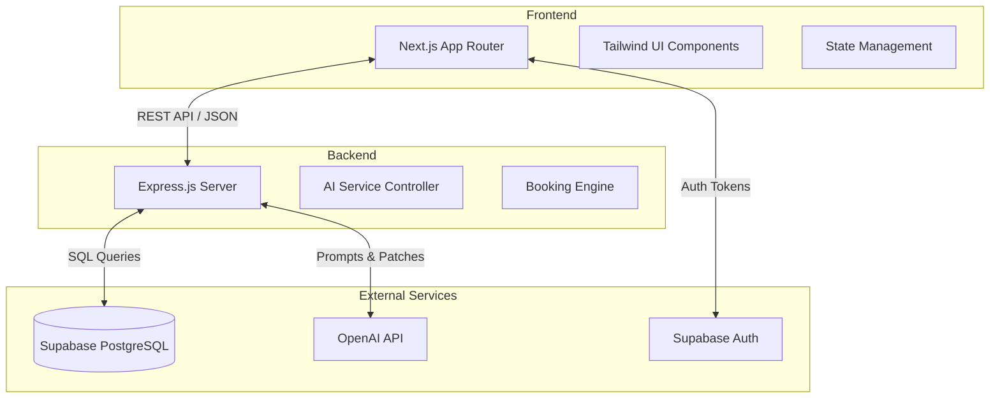
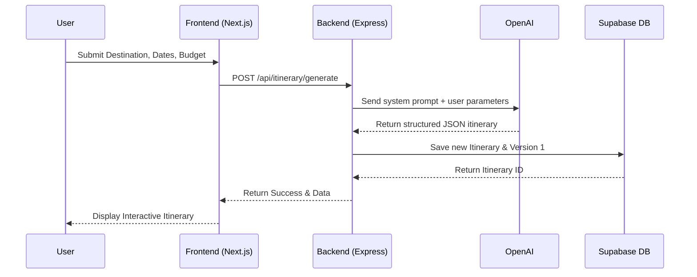
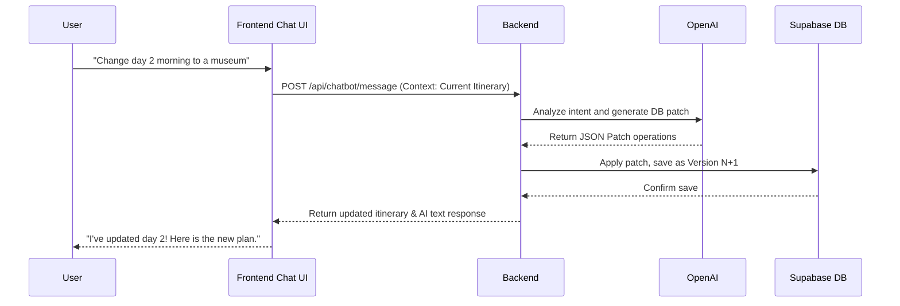

# System Architecture

This document describes the high-level architecture and system flow for TravelGenie.

## High-Level Architecture

TravelGenie follows a standard decoupled Client-Server architecture utilizing a modern serverless approach where possible.

## System Flow: Trip Generation

The following diagram illustrates the flow when a user requests a new itinerary.

## System Flow: Chatbot Modification

