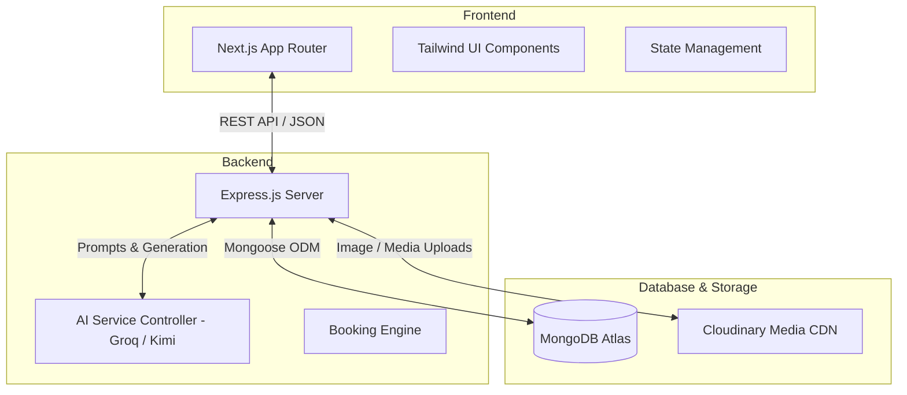
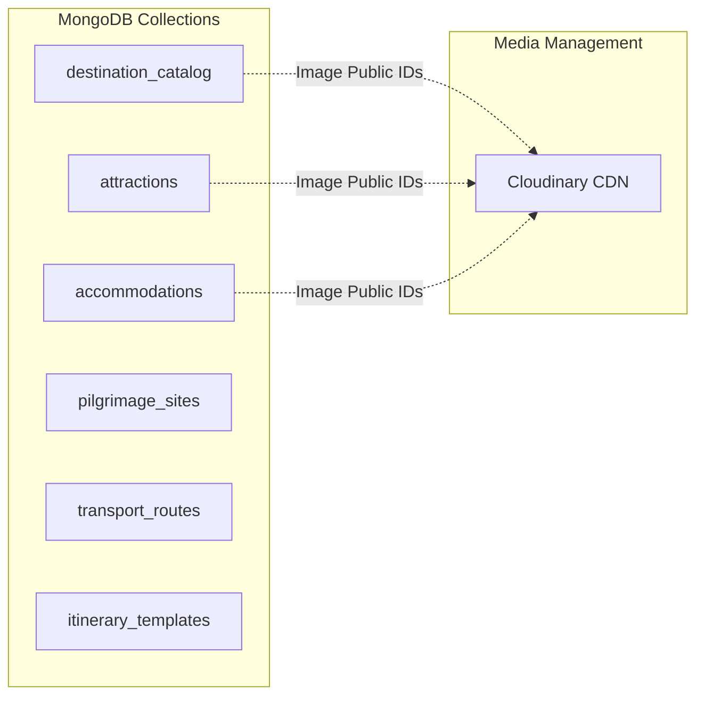
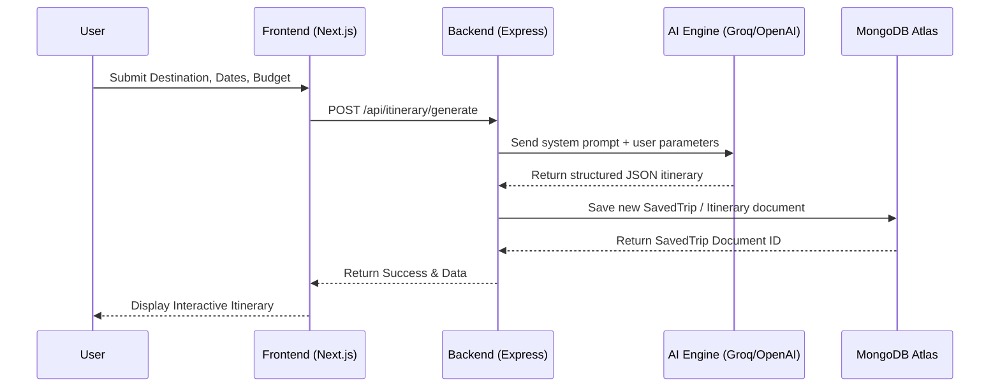
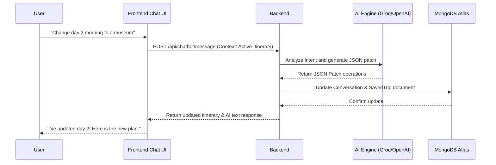

# System Architecture

This document describes the high-level architecture and system flow for TravelGenie.

## High-Level Architecture

TravelGenie follows a decoupled Client-Server architecture with a Next.js frontend and an Express.js backend powered by MongoDB Atlas and Cloudinary.

## Data Layer Architecture (MongoDB + Cloudinary)

## System Flow: Trip Generation

The following diagram illustrates the flow when a user requests a new itinerary.

## System Flow: Chatbot Modification

