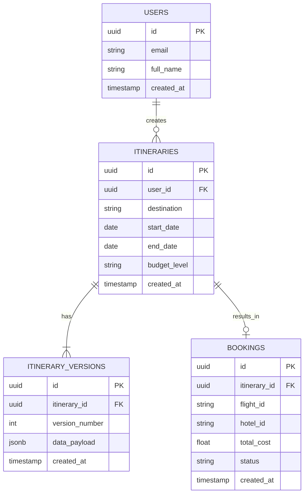

# Database Schema

TravelGenie utilizes Supabase PostgreSQL. This document outlines the Entity-Relationship structure.

## ER Diagram

## Tables Details

### `users`
Managed primarily by Supabase Auth, but extended here for profile data.
- `id`: UUID (Primary Key)
- `email`: VARCHAR
- `full_name`: VARCHAR

### `itineraries`
The parent object for a trip.
- `id`: UUID (Primary Key)
- `user_id`: UUID (Foreign Key to users)
- `destination`: VARCHAR
- `budget_level`: VARCHAR (e.g., 'Low', 'Medium', 'High')

### `itinerary_versions`
Stores the actual JSON payload of the trip. The chatbot appends new versions here.
- `id`: UUID (Primary Key)
- `itinerary_id`: UUID (Foreign Key)
- `version_number`: INT (Increments for every chatbot modification)
- `data_payload`: JSONB (The structured days, activities, and metadata)

### `bookings`
Stores the final booked states.
- `status`: VARCHAR ('PENDING', 'CONFIRMED', 'FAILED_FLIGHT', 'FAILED_HOTEL')
