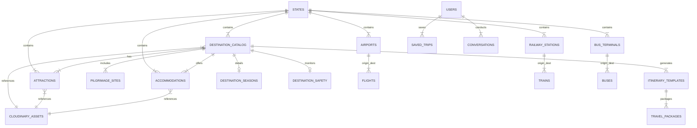

# Database Schema Architecture

TravelGenie utilizes **MongoDB Atlas** with **Mongoose 8.x ODM** and **Cloudinary** for media asset hosting. This document outlines the Entity-Relationship and document model structure.

## ER & Collection Diagram



## Collections & Schema Overview

### 1. `states`
- **`_id`**: String (ISO code e.g. `IN-MH`, `IN-KA`)
- **`name`**: String (e.g. "Maharashtra")
- **`code`**: String (e.g. "MH")
- **`type`**: Enum (`STATE`, `UT`)
- **`region`**: String (e.g. "West", "North", "South")
- **`capital`**: String

### 2. `destination_catalog`
- **`_id`**: String (Deterministic slug e.g. `mumbai-mh`)
- **`stateId`**: String (Ref: `states`)
- **`name`**: String
- **`type`**: String (e.g. "Metropolis", "Hill Station", "Beach")
- **`location`**: GeoJSON Point `{ type: "Point", coordinates: [lng, lat] }`
- **`estimatedDailyBudget`**: `{ min: Number, max: Number }`
- **`budgetCategory`**: Enum (`BUDGET`, `MID_RANGE`, `LUXURY`)
- **`images`**: Array of Cloudinary metadata objects `{ url: String, publicId: String, altText: String }`

### 3. `attractions`
- **`_id`**: String (Slug e.g. `gateway-of-india`)
- **`destinationId`**: String (Ref: `destination_catalog`)
- **`stateId`**: String (Ref: `states`)
- **`name`**: String
- **`category`**: String (e.g. "Historical", "Nature", "Theme Park")
- **`entryFee`**: `{ inr: Number, currency: "INR" }`
- **`location`**: GeoJSON Point `{ type: "Point", coordinates: [lng, lat] }`
- **`rating`**: Number (1.0 to 5.0)
- **`images`**: Array of Cloudinary metadata objects

### 4. `accommodations`
- **`_id`**: String
- **`destinationId`**: String (Ref: `destination_catalog`)
- **`type`**: Enum (`HOTEL`, `RESORT`, `HOMESTAY`, `HOSTEL`)
- **`pricePerNight`**: `{ min: Number, max: Number }`
- **`amenities`**: Array of Strings
- **`location`**: GeoJSON Point
- **`rating`**: Number

### 5. `transport_routes` (Flights, Trains, Buses, Transport Routes)
- **`airports`**, **`railway_stations`**, **`bus_terminals`**: Geospatial hubs with IATA/Station codes.
- **`flights`**, **`trains`**, **`buses`**: Transit schedules, operator details, and fare structures.
- **`transport_routes`**: Distance in km and estimated duration in hours between hub pairs.

### 6. `users` & `saved_trips`
- **`users`**: `full_name`, `email`, `password` (hashed), `isVerified`, `avatar_url`
- **`saved_trips`**: `userId`, `destination`, `source`, `startDate`, `endDate`, `travelers`, `budgetINR`, `transportType`, `itineraryDetails` (JSON object)
- **`conversations`**: `userId`, `messages` array (`role`, `content`, `timestamp`)

## Cloudinary Media Integration
All media assets across collections (`destination_catalog`, `attractions`, `accommodations`, `pilgrimage_sites`) use Cloudinary metadata structures:
```json
{
  "url": "https://res.cloudinary.com/<cloud_name>/image/upload/v123456789/travelgenie/destinations/mumbai.jpg",
  "publicId": "travelgenie/destinations/mumbai",
  "altText": "Gateway of India view",
  "type": "IMAGE"
}
```
