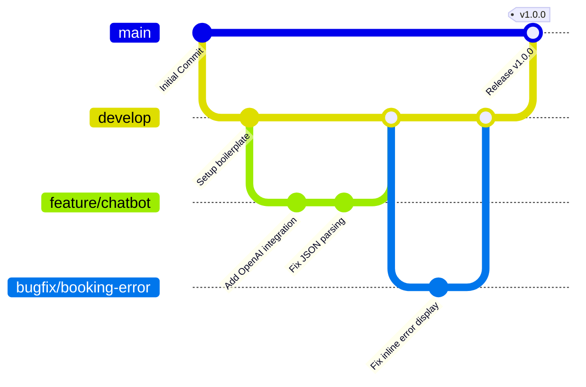
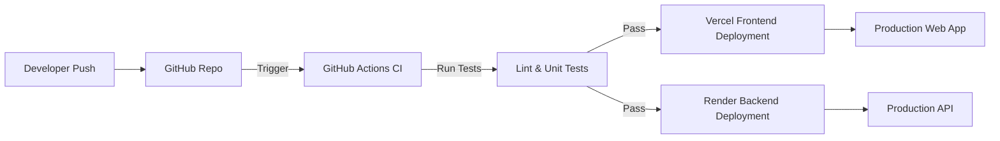

# Deployment Strategy & CI/CD

This document outlines how TravelGenie is tested, built, and deployed to production.

## Git Branch Strategy

We follow a simplified GitFlow model tailored for a small, fast-moving team.

## Deployment Flow

## Deployment Checklist

Before merging `develop` into `main` for a release, ensure the following checklist is completed:

- [ ] **Tests Passing:** All GitHub Actions workflows are green.
- [ ] **Environment Variables:** All required production keys (OpenAI, Supabase) are securely set in Vercel and Render dashboards.
- [ ] **Database Migrations:** Any new Supabase tables, views, or RLS policies have been applied to the production database instance.
- [ ] **Mock Data:** Ensure the mock JSON files (for the MVP budget module) are accessible by the production backend environment.
- [ ] **Performance Audit:** Run Lighthouse on the staging deployment to ensure UX/UI guidelines are met.

## Hosting Platforms
- **Frontend:** Vercel (Automatic deployments via GitHub integration on `main` branch).
- **Backend:** Render (Web Service linked to the GitHub repository, deploying on `main` branch).
- **Database:** Supabase Cloud.
