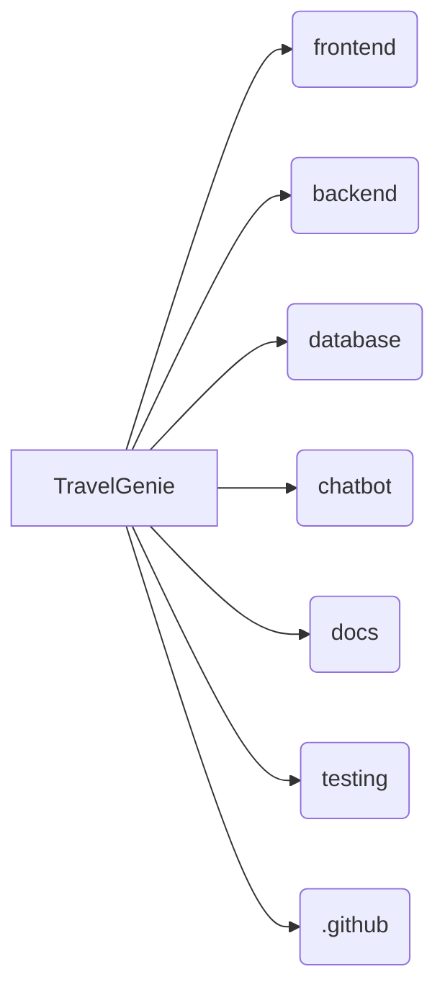

# TravelGenie - Your AI Travel Companion


## Introduction

Welcome to **TravelGenie**, an AI-powered travel planning platform designed to revolutionize how people plan, budget, and book their trips. Acting as your personal travel companion, TravelGenie generates intelligent itineraries, compares travel options according to your budget, allows conversational modifications through an AI chatbot, and facilitates seamless bookings.

## Project Goals

- 🧠 **Intelligent Itinerary Generation:** Automate trip planning based on destination, dates, budget, transport, and personal preferences.
- 💰 **Cost Optimization:** Compare flights, trains, buses, hotels, and packages to rank options according to user budgets.
- 💬 **Conversational Interface:** Provide an intuitive AI chatbot to modify itineraries on the fly and synchronize with MongoDB storage.
- 🖼️ **Rich Media Integration:** Cloudinary CDN hosting for destination, attraction, and hotel visual assets.
- 💳 **Seamless Booking Experience:** Integrated test-mode payment processing via Razorpay.

## Key Features

- 🗺️ **Comprehensive Destination Catalog:** 17+ Mongoose collection models covering Indian states, destinations, attractions, pilgrimage sites, airports, railway stations, bus terminals, and routes.
- 📍 **Geospatial Search:** 2dsphere indexing for radius-based attraction and hotel discovery (`$near`, `$geoWithin`).
- ⚡ **Groq AI Integration:** Ultra-fast LLM itinerary generation and chat response streaming.
- 🗄️ **MongoDB Atlas & Mongoose 8.x:** Deterministic document ID strategy with zero orphan records and provenance tracking.


## Technology Stack

- **Frontend:** Next.js (App Router), React, Tailwind CSS, TypeScript
- **Backend:** Express.js, Node.js REST API (`/backend`)
- **Database:** MongoDB Atlas (Mongoose ODM) — see [database/DATABASE.md](database/DATABASE.md)
- **Media CDN:** Cloudinary — see [backend/config/cloudinary.js](backend/config/cloudinary.js)
- **AI Integration:** Groq Cloud AI / OpenAI SDK
- **Payments:** Razorpay Test Mode

## Folder Structure



| Directory | Purpose |
| --- | --- |
| `/frontend` | Next.js application codebase. |
| `/backend` | Express.js REST API server logic, models, and middleware. |
| `/database` | MongoDB models, seed generators, data integrity validators (`database/DATABASE.md`). |
| `/chatbot` | AI conversation logic and prompt engineering scripts. |
| `/docs` | System documentation, diagrams, sprint records. |
| `/testing` | Automated test suites and test plan documents. |

## Installation & Setup

### Prerequisites
- Node.js (v18 or higher)
- npm or yarn
- MongoDB Atlas Cluster or local MongoDB instance

### Setup Steps
1. **Clone the repository:**
   ```bash
   git clone https://github.com/Jiyathakurrr/TravelGenie.git
   cd TravelGenie
   ```
2. **Environment Variables:**
   Populate `.env` in the root/backend directories following `.env.example`:
   ```env
   MONGODB_URI=your_mongodb_connection_string
   MONGODB_DB_NAME=travelgenie
   CLOUDINARY_CLOUD_NAME=your_cloudinary_name
   CLOUDINARY_API_KEY=your_cloudinary_key
   CLOUDINARY_API_SECRET=your_cloudinary_secret
   ```
3. **Seed Database:**
   ```bash
   npm run seed
   npm run validate-data
   ```
4. **Run Backend & Frontend:**
   ```bash
   # Run Backend
   cd backend && npm run dev

   # Run Frontend
   cd ../frontend && npm run dev
   ```

## License

This project is licensed under the MIT License - see the [LICENSE](LICENSE) file for details.
