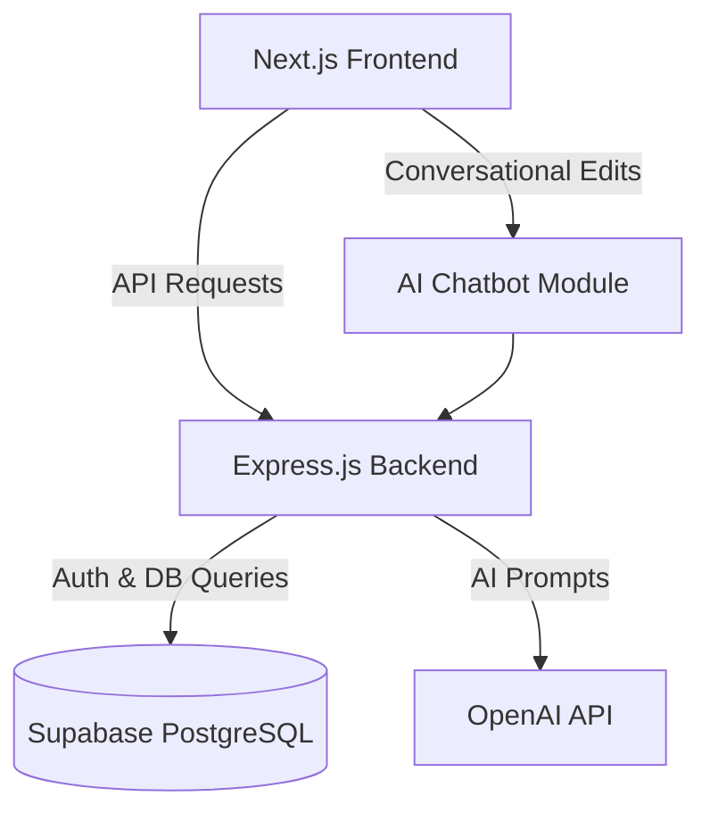
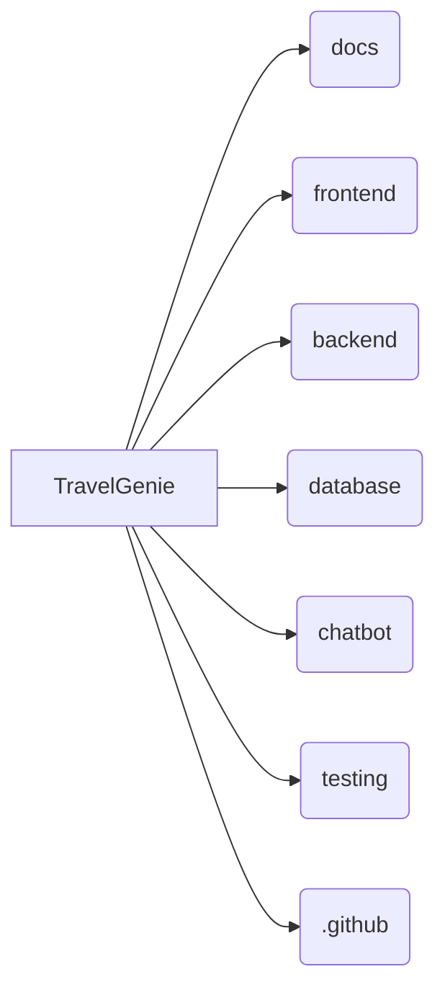

# TravelGenie - Your AI Travel Companion


## Introduction

Welcome to **TravelGenie**, an AI-powered travel planning platform designed to revolutionize how people plan, budget, and book their trips. Acting as your personal travel companion, TravelGenie generates intelligent itineraries, compares travel options according to your budget, allows conversational modifications through an AI chatbot, and facilitates seamless bookings.

## Project Goals

- **Intelligent Itinerary Generation:** Automate trip planning based on destination, dates, budget, and preferences.
- **Cost Optimization:** Compare flights, hotels, and packages to rank options according to user budgets.
- **Conversational Interface:** Provide an intuitive AI chatbot to modify itineraries on the fly and patch them directly to the database.
- **Seamless Booking Experience:** Gracefully handle price fluctuations and availability issues during the booking process without redirecting users abruptly.

## Key Features

- 🧠 **Trip Planning Engine:** AI-driven scheduling that accounts for user constraints.
- 💰 **Budget Comparison Module:** Local mock JSON-based budget analysis (MVP phase) for flights, hotels, and packages.
- 💬 **AI Chatbot:** OpenAI-integrated chatbot capable of reading the itinerary and suggesting or applying real-time modifications.
- 🏨 **Resilient Booking Module:** Handles edge cases like unavailable hotels and flights with inline error management.
- 🗄️ **Itinerary Versioning:** Stores multiple versions of an itinerary as the user converses with the AI.

## Architecture Overview


*For a detailed high-level architecture, see [ARCHITECTURE.md](ARCHITECTURE.md).*

## Technology Stack

- **Frontend:** Next.js, React, Tailwind CSS, TypeScript
- **Backend:** Node.js, Express.js
- **Database:** Supabase PostgreSQL
- **Authentication:** Supabase Auth
- **AI Integration:** OpenAI API
- **Deployment:** Vercel (Frontend), Render (Backend), Supabase (Database)

## Folder Structure



| Directory | Purpose |
| --- | --- |
| `/docs` | Comprehensive project documentation, diagrams, sprint plans, and research. |
| `/frontend` | Next.js application codebase. |
| `/backend` | Express.js API and server logic. |
| `/database` | Database schemas, migrations, and seed data. |
| `/chatbot` | AI conversation logic and itinerary modification scripts. |
| `/testing` | E2E, Integration, and Unit tests. |
| `/.github` | CI/CD workflows, issue templates, and PR templates. |

## Development Roadmap

Please refer to our detailed [ROADMAP.md](ROADMAP.md) and [PROJECT_PLAN.md](PROJECT_PLAN.md) for milestone tracking.

## Installation Instructions

### Prerequisites
- Node.js (v18 or higher)
- npm or yarn
- Git
- Supabase account & project setup
- OpenAI API Key

### Setup Steps
1. **Clone the repository:**
   ```bash
   git clone https://github.com/your-org/TravelGenie.git
   cd TravelGenie
   ```
2. **Environment Variables:**
   Copy `.env.example` to `.env` in both frontend and backend directories and populate your Supabase and OpenAI keys.
   ```bash
   cp .env.example .env
   ```
3. **Install Dependencies:**
   ```bash
   # Frontend
   cd frontend
   npm install

   # Backend
   cd ../backend
   npm install
   ```
4. **Run Locally:**
   ```bash
   # Run Backend (Terminal 1)
   npm run dev

   # Run Frontend (Terminal 2)
   cd ../frontend
   npm run dev
   ```

## Contributors

The TravelGenie platform is developed and maintained by:

- **Prachi** - *Product Manager & Research Coordinator* (Product decisions, sprint planning, documentation)
- **Jiya** - *Developer & Tester* (Full-stack development, AI chatbot, database integration, QA)
- **Hitanshi** - *System Designer & Deployer* (Architecture, DB design, CI/CD, DevOps)

See [TEAM_ROLES.md](TEAM_ROLES.md) for detailed responsibilities.

## Future Scope

- Integration with real flight/hotel APIs (e.g., Amadeus, Skyscanner).
- Collaborative trip planning for groups.
- Mobile application development (React Native).
- Offline mode for viewing itineraries while traveling.


## FAQ

**Q: Is the Budget Comparison Module using live data?**
A: For the MVP, we are using mock JSON files to simulate flight and hotel data to ensure robust system testing before integrating paid live APIs.

**Q: How does the AI chatbot modify the database directly?**
A: The chatbot translates user intent into JSON patches, which the backend validates and applies to the Supabase database as a new itinerary version.

## License

This project is licensed under the MIT License - see the [LICENSE](LICENSE) file for details.
